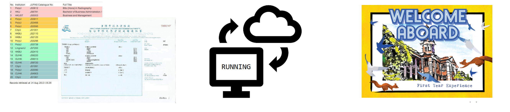
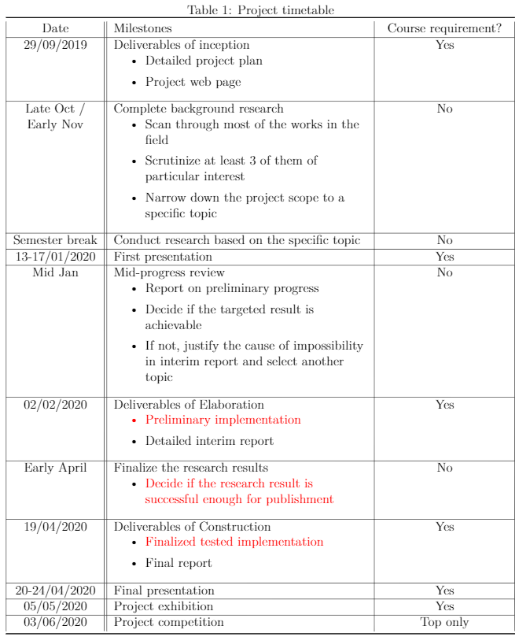

## Welcome to Haley Kwok's FYP project!

I am working individually under the supervision of [Dr. Z. Y. Huang](https://i.cs.hku.hk/~zhiyi/), towards the topic "Theorectical Research on **Online Matching**".

# Table of context
1. [Introduction](#introduction)
2. [Research Scope](#research-scope)
3. [Documentations](#documentations)

# Introduction
## So what is **Online Matching**?

The "matching" here is referring to "Graph Matching" here. If you happened to be a UG student who is fond of algorithms, you might recall that you have heard this term from algorithmatic courses such as [COMP3351 Advanced Algorithm Analysis](https://www.cs.hku.hk/index.php/programmes/course-offered?infile=2018/comp3351.html), [COMP3352 Game Theory](https://www.cs.hku.hk/index.php/programmes/course-offered?infile=2019/comp3352.html).

**What if I have never heard the topic?**

You are most definitely missing out one of the most important classic algorithmatic field in the community, and should definitely read up some information about it due to its wide range of application. For example, matching algorithm is used for administrative purposes in the campus, such as [allocating dorms](http://timroughgarden.org/f13/l/l10.pdf) and [admitting new students](https://www.youtube.com/watch?v=xYkiCtlALHA).

Owing to its popularity, I could guarantee you to find some chapters in any algorithmatic introductory textbooks at introductory level. However, if you have never heard of graph matching, _chances are -- You don't have one with you, do you?_ As a workaround, we suggest you to check out this video by Udacity to learn the basics. 

<iframe width="560" height="315" src="https://www.youtube.com/embed/bOJC93XxoFc" frameborder="0" allow="autoplay; encrypted-media" allowfullscreen></iframe>

**If you prefer reading text**

You may check out the [wiki article](https://en.wikipedia.org/wiki/Matching_(graph_theory)) that is fairly well written, or the appendices of the [Detailed Project Plan](#documentations).

# Research Scope

**Isn't "Graph Matching" a solved problem? What are trying to achieve with this project?**

While the Graph Matching problem has been solved in the classical (i.e. offline) setting, a lot of questions remains to be unsolved in the **online** setting.

**You kept bringing this "Online" term up, what difference does it make?**

In the context of algorithm analysis, whenever we say some problem is "online", we mean that not all information is available to the algorithm at the time of initialization, and they are revealed eventually as the algorithm runs. To demonstrate the difference, let's consider the difference between **Bachelor** and **PhD** admission.

  
 <strong>Bachelor</strong> admissions 

  
  
  
  <strong>Bachelor</strong> degree offers are handed out on a yearly basis. The JUPAS system gathers all the information before it makes an informed decision, such as slots offered by each degree programme, applicants' preferences and their public examination transcripts. Just as good ol' Uncle John says, 
  
> "<em>With perfect information comes perfect solution.</em>", proooobably Uncle John.

This offline matching problem is said to be "solved", because the algorithm is capable of deriving an optimal solution, given full information on initialization.

  
 <strong>PhD</strong> admissions 

  
  

  On the other hand, <strong>PhD</strong> applications are handled in a rolling basis in HKU CS. After the department opens for Phd applications on September, applications begin to flood in throughout the year. If the professors were to handle the admission only after the application process is closed on May, there is simply no hope for them to go through all of them, and students may have already accepted some other institutions offer instead. 
  
  To keep the students interested (<em>and professors away from overworking</em>), the office clears the application pool periodically and hand out offers. As a tradeoff, since the department does not have perfect information on all its potential candidates at the earlier clearing stages, they does not always admit the best students out of all the applicants -- Maybe they ran out of slots by the time a strong candidate applied, or they rejected the strong candidate, hoping that the next Einstein will make his application on April which never showed up in reality.

Under this analogy, the Online Matching problem is not solved, as there is a gap between the performance of the best existing algorithm and what the law of nature permits us to achieve.

**What model / methodology does the project use?**

The analysis is expected to be carried out under the Randomized Primal-Dual framework. If this happened to be the first time you have came across analysis done with dual Linear Programming, please take a look at this excellent video by Georgia Tech introducing the concept of duality in the context of maximum graph matching.

<iframe width="560" height="315" src="https://www.youtube.com/embed/ULI8fJoiG_c" frameborder="0" allow="autoplay; encrypted-media" allowfullscreen></iframe>

Furthermore, it is highly likely that the work will be done under the fully online model. For a more detailed coverage of the model, please read the introduction section of the [**Detailed Project Plan**](#documentations).

# Project Progress

Current stage: Scruntizing papers and crunching numbers, understanding the approaches used by the current research frontier.

## Schedule

This is a tentative schedule extracted from the [**Detailed Project Plan**](#documentations).

# Documentations

[Detailed Project Plan](public/doc/Project_plan.pdf?raw=true)
